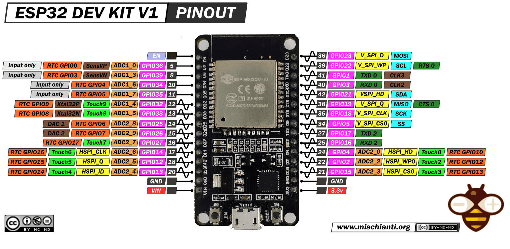

# ESP32 DOIT DevKit V1 — Tài liệu tham khảo chân và ngoại vi

Ngày biên soạn: **06/10/2026**. Phạm vi: **ESP32 cổ điển, module ESP-WROOM-32, board DOIT DevKit V1 bản 30 chân trong ảnh**. Không dùng bảng này cho ESP32-C3/S2/S3 hoặc board có thứ tự header khác.

## Mục lục

1. [Cơ sở tài liệu và cách đọc ảnh](#1-cơ-sở-tài-liệu-và-cách-đọc-ảnh)
2. [Các linh kiện và khối chức năng trên board](#2-các-linh-kiện-và-khối-chức-năng-trên-board)
3. [Bảng đầy đủ 30 chân header](#3-bảng-đầy-đủ-30-chân-header)
4. [Nguồn điện và mức logic](#4-nguồn-điện-và-mức-logic)
5. [Chân khởi động, reset và chân cần thận trọng](#5-chân-khởi-động-reset-và-chân-cần-thận-trọng)
6. [Ngoại vi tích hợp trong ESP32](#6-ngoại-vi-tích-hợp-trong-esp32)
7. [Gợi ý phân bổ chân cho dự án WiFi Scan](#7-gợi-ý-phân-bổ-chân-cho-dự-án-wifi-scan)
8. [Ví dụ Arduino để tra cách cấu hình](#8-ví-dụ-arduino-để-tra-cách-cấu-hình)
9. [Tra lỗi khi đấu nối](#9-tra-lỗi-khi-đấu-nối)
10. [Nguồn tham khảo](#10-nguồn-tham-khảo)

## 1. Cơ sở tài liệu và cách đọc ảnh



Ảnh gốc nằm trong [thư mục img](img/ESP32-DOIT-DEV-KIT-v1-pinout-mischianti.png), mang tên tác giả/trang Mischianti. Giữ nguyên ảnh và thông tin giấy phép hiển thị trên ảnh.

**Hướng nhìn:** nhìn từ mặt linh kiện; anten ở trên, cổng micro-USB ở dưới. Hàng trái bắt đầu bằng EN, hàng phải bắt đầu bằng GPIO23. Nhìn từ mặt hàn sẽ đảo trái/phải.

| Ký hiệu trong ảnh | Cách hiểu |
| --- | --- |
| GPIOxx, nền hồng | Số GPIO dùng trong chương trình: GPIO23 tương ứng `pinMode(23, OUTPUT)` |
| Số trắng, nền xám, cạnh GPIO | Số chân trên package chip ESP32; không phải thứ tự chân header hoặc số Arduino |
| ADC1_x / ADC2_x | Bộ ADC và kênh: ADC1_4 nghĩa là ADC1_CH4 |
| RTC GPIOx, nền cam | Chỉ số chân thuộc miền RTC, khác với số GPIO thông thường |
| Touchx | Kênh cảm ứng điện dung |
| DAC1 / DAC2 | Kênh chuyển đổi số sang analog |
| TXD / RXD | Tín hiệu truyền/nhận UART |
| MOSI / MISO / SCK / SS | Tín hiệu SPI |
| SDA / SCL | Tín hiệu I²C |
| Input only | Chỉ làm đầu vào |

Một chân có nhiều nhãn vì có nhiều chức năng lựa chọn. Không xem các nhãn đó là các chân riêng biệt hoặc các chức năng mặc nhiên cùng hoạt động. Chân số có thể đổi mapping qua GPIO matrix; ADC, DAC và Touch gắn với chân phần cứng cụ thể. [GPIO matrix của Espressif](https://docs.espressif.com/projects/arduino-esp32/en/latest/tutorials/io_mux.html)

**Đính chính ảnh:** GPIO26 được ghi `ADC2_7`; đúng là **ADC2_CH9**. GPIO27 mới là ADC2_CH7. Bảng dưới đã sửa lỗi này. Nhãn `HSPI_ID` ở GPIO13 nên đọc theo tín hiệu **HSPID / MOSI**. [Datasheet ESP32](https://documentation.espressif.com/esp32_datasheet_en.html)

Thông tin cục bộ: [AGENT.md](AGENT.md) ghi nhận một lần đọc phần cứng trước đây: ESP32-D0WDQ6, flash 4 MB, không PSRAM, USB–UART CP2102. Đây là ghi nhận có sẵn, **chưa đo lại board đang cắm**. [platformio.ini](platformio.ini) hiện chọn `esp32dev`, Arduino, CPU 240 MHz, flash 4 MB. Tên board trong cấu hình không tự xác nhận model phần cứng.

## 2. Các linh kiện và khối chức năng trên board

Phân biệt **linh kiện trên PCB** với **ngoại vi bên trong chip**. Board đưa các tín hiệu ra header; không có sẵn màn hình, cảm biến môi trường, khe thẻ SD hay transceiver CAN.

| Linh kiện/khối | Vai trò | Cách nhận biết hoặc giới hạn xác nhận |
| --- | --- | --- |
| Module ESP-WROOM-32 | Chứa chip ESP32, flash và phần RF | Khối có vỏ kim loại, chữ ESP-WROOM-32 trong ảnh |
| Anten PCB | Phát/thu WiFi và Bluetooth | Phần trên module, ngoài vùng vỏ kim loại; nên để thoáng khi lắp hộp |
| Chip ESP32 | Chạy firmware, xử lý GPIO và ngoại vi | Nằm trong module, không nhìn thấy trực tiếp qua ảnh |
| Flash SPI | Lưu bootloader, chương trình và dữ liệu | Nằm trong module; 4 MB theo ghi nhận cục bộ |
| Thạch anh | Cung cấp clock tham chiếu | Nằm trong module; 40 MHz theo ghi nhận cục bộ |
| Micro-USB | Cấp nguồn và nối máy tính để nạp/log | Nằm dưới board; cần cáp có dây dữ liệu |
| USB–UART | Chuyển USB của máy tính thành UART0 | IC gần cổng USB; CP2102 theo ghi nhận cục bộ, cần đọc nhãn/USB ID để xác nhận board thực tế |
| Bộ ổn áp 3,3 V | Hạ điện áp đường nguồn vào để cấp module | Linh kiện công suất phía dưới module; không chốt model hoặc dòng khả dụng chỉ từ ảnh |
| Mạch tự nạp/reset | Dùng tín hiệu điều khiển từ USB–UART để tác động EN và GPIO0 | Có trên nhiều board phát triển; topology và độ tin cậy phụ thuộc phiên bản PCB |
| Nút EN | Reset ESP32 bằng cách kéo EN xuống LOW | Nút trái cạnh USB theo ảnh |
| Nút BOOT | Kéo GPIO0 xuống LOW để chọn chế độ nạp khi reset | Nút phải cạnh USB theo ảnh |
| LED báo nguồn | Cho biết có nguồn tại đường mà LED được nối | LED sáng không chứng minh firmware đang chạy |
| LED lập trình được | Báo trạng thái bằng chương trình | Thiết kế DOIT được Zephyr mô tả có LED xanh tại GPIO2; xác nhận lại với clone |
| Tụ, điện trở và linh kiện phụ | Lọc nguồn, kéo mức, hạn dòng, hỗ trợ reset | Không suy ra trị số/BOM từ ảnh pinout |
| Hai hàng header | Kết nối nguồn, reset và GPIO với mạch ngoài | 15 chân mỗi bên; tổng cộng 25 GPIO và 5 chân nguồn/điều khiển |

LED GPIO2 và nút BOOT GPIO0 được mô tả trong [tài liệu board của Zephyr](https://docs.zephyrproject.org/latest/boards/others/doit_esp32_devkit_v1/doc/index.html). Nguyên lý tự nạp bằng DTR/RTS được mô tả trong [tài liệu esptool](https://docs.espressif.com/projects/esptool/en/latest/esp32/advanced-topics/boot-mode-selection.html). Đây không phải bằng chứng mọi board clone có cùng linh kiện.

## 3. Bảng đầy đủ 30 chân header

**L1…L15 và R1…R15 là chỉ số quy ước của tài liệu**, đếm từ trên xuống theo hướng ảnh. Trong chương trình luôn dùng số GPIO.

Quy ước: `I/O` = vào/ra số; `IN` = chỉ vào; `—` = không áp dụng. Các chức năng trong cột bảng là những chức năng tiêu biểu để tra nhanh.

### 3.1. Hàng trái

| Vị trí | Chân | Hướng | ADC | RTC / Touch / DAC | Chức năng và cách chọn |
| --- | --- | --- | --- | --- | --- |
| L1 | EN | Điều khiển | — | — | Enable/reset; LOW để reset, không phải GPIO |
| L2 | GPIO36 / VP | IN | ADC1_CH0 | RTC_GPIO0 | Đọc analog hoặc input số; không có điện trở kéo nội |
| L3 | GPIO39 / VN | IN | ADC1_CH3 | RTC_GPIO3 | Đọc analog hoặc input số; không có điện trở kéo nội |
| L4 | GPIO34 | IN | ADC1_CH6 | RTC_GPIO4 | Gợi ý cho cảm biến analog khi dùng WiFi |
| L5 | GPIO35 | IN | ADC1_CH7 | RTC_GPIO5 | Gợi ý cho cảm biến analog khi dùng WiFi |
| L6 | GPIO32 | I/O | ADC1_CH4 | RTC_GPIO9, Touch9 | GPIO, analog, Touch; dùng chung chức năng XTAL32K_P |
| L7 | GPIO33 | I/O | ADC1_CH5 | RTC_GPIO8, Touch8 | GPIO, analog, Touch; dùng chung chức năng XTAL32K_N |
| L8 | GPIO25 | I/O | ADC2_CH8 | RTC_GPIO6, DAC1 | GPIO/PWM hoặc DAC; ADC2 có giới hạn với WiFi |
| L9 | GPIO26 | I/O | **ADC2_CH9** | RTC_GPIO7, DAC2 | GPIO/PWM hoặc DAC; đã sửa nhãn sai trong ảnh |
| L10 | GPIO27 | I/O | ADC2_CH7 | RTC_GPIO17, Touch7 | Phù hợp nút nhấn/input/output; ADC2 có giới hạn với WiFi |
| L11 | GPIO14 | I/O | ADC2_CH6 | RTC_GPIO16, Touch6 | HSPI SCK; JTAG MTMS; xét xung đột nếu dùng debugger |
| L12 | GPIO12 | I/O | ADC2_CH5 | RTC_GPIO15, Touch5 | HSPI MISO; JTAG MTDI; **strapping nguồn flash** |
| L13 | GPIO13 | I/O | ADC2_CH4 | RTC_GPIO14, Touch4 | HSPI MOSI; JTAG MTCK; xét xung đột nếu dùng debugger |
| L14 | GND | Nguồn | — | — | Mass, nối GND chung với ngoại vi |
| L15 | VIN | Nguồn | — | — | Đường nguồn vào của board; xem mục 4 trước khi cấp nguồn |

### 3.2. Hàng phải

| Vị trí | Chân | Hướng | ADC | RTC / Touch | Chức năng và cách chọn |
| --- | --- | --- | --- | --- | --- |
| R1 | GPIO23 | I/O | — | — | VSPI MOSI hoặc GPIO |
| R2 | GPIO22 | I/O | — | — | I²C SCL mặc định; có thể làm GPIO khi không dùng I²C |
| R3 | GPIO1 / TX0 | I/O | — | — | UART0 TX, thường nối USB–UART để nạp và log |
| R4 | GPIO3 / RX0 | I/O | — | — | UART0 RX, thường nối USB–UART để nạp và log |
| R5 | GPIO21 | I/O | — | — | I²C SDA mặc định; có thể làm GPIO khi không dùng I²C |
| R6 | GPIO19 | I/O | — | — | VSPI MISO hoặc GPIO |
| R7 | GPIO18 | I/O | — | — | VSPI SCK hoặc GPIO |
| R8 | GPIO5 | I/O | — | — | VSPI CS mặc định; **strapping**, xem tải lúc reset |
| R9 | GPIO17 / TX2 | I/O | — | — | UART2 TX theo mapping trong ảnh; phù hợp WROOM không PSRAM |
| R10 | GPIO16 / RX2 | I/O | — | — | UART2 RX theo mapping trong ảnh; phù hợp WROOM không PSRAM |
| R11 | GPIO4 | I/O | ADC2_CH0 | RTC_GPIO10, Touch0 | GPIO/Touch; không thuộc 5 strapping pins tiêu chuẩn |
| R12 | GPIO2 | I/O | ADC2_CH2 | RTC_GPIO12, Touch2 | **Strapping**; có thể nối LED trên board |
| R13 | GPIO15 | I/O | ADC2_CH3 | RTC_GPIO13, Touch3 | HSPI CS; JTAG MTDO; **strapping** |
| R14 | GND | Nguồn | — | — | Mass chung với GND hàng trái |
| R15 | 3V3 | Nguồn | — | — | Đường 3,3 V của board; không phải GPIO |

Vị trí và phần lớn nhãn lấy từ ảnh cục bộ. Mapping ADC sửa theo [datasheet ESP32](https://documentation.espressif.com/esp32_datasheet_en.html); mapping mặc định I²C/VSPI tham khảo [pins_arduino.h của Espressif](https://github.com/espressif/arduino-esp32/blob/master/variants/esp32/pins_arduino.h).

### 3.3. Các chân không đưa ra header trong ảnh

| GPIO | Vai trò hoặc lý do không dùng để đấu ngoại vi |
| --- | --- |
| GPIO0 | Nút BOOT, chọn chế độ khởi động; có ADC2_CH1, Touch1, RTC_GPIO11 nhưng không có chân header ở bản này |
| GPIO6–11 | Bus flash bên trong module; tránh can thiệp |
| GPIO37, GPIO38 | Chân input/ADC1 của chip, không được đưa ra header của board trong ảnh |

Không suy ra rằng ESP32 có đủ GPIO từ 0 đến 39 liên tục. Nhãn VP/VN là tên chân của chip; không phải cặp đầu vào đo vi sai tùy ý.

## 4. Nguồn điện và mức logic

| Chân/đường nguồn | Cách sử dụng |
| --- | --- |
| Micro-USB | Cách cấp nguồn/nạp thuận tiện trong dự án này |
| VIN | Trên thiết kế loại này thường thuộc đường nguồn danh định 5 V trước ổn áp; cần xác nhận sơ đồ/đo board thực tế trước khi cấp ngoài |
| 3V3 | Cấp ngoại vi 3,3 V trong ngân sách dòng thực tế; cấp ngược vào chân này sẽ đi trực tiếp vào rail 3,3 V |
| GND | Nối mass chung giữa board và ngoại vi không cách ly |
| GPIO | Logic 3,3 V; dùng chia áp hoặc chuyển mức khi nhận tín hiệu 5 V |

Module WROOM-32 có nguồn làm việc 3,0–3,6 V, danh định 3,3 V. Không đưa 5 V vào 3V3 hoặc GPIO. [Datasheet WROOM-32, phần Electrical Characteristics](https://documentation.espressif.com/esp32-wroom-32_datasheet_en.html)

Hướng dẫn đấu nối thực tế:

- Chọn một đường cấp nguồn khi chưa biết mạch bảo vệ của board; tránh USB và nguồn VIN/3V3 ngoài cùng cấp gây backfeed.
- Không coi tên VIN là cho phép cấp 9–12 V. Phải xét IC nguồn, nhiệt và linh kiện của đúng PCB.
- GPIO điều khiển relay/motor qua transistor, MOSFET hoặc driver; không cấp tải trực tiếp từ GPIO. Cuộn dây DC cần xử lý điện áp ngược.
- Servo, motor và tải dòng lớn nên có nguồn phù hợp riêng; nối GND chung nếu không cách ly.
- Không lấy dòng định mức riêng của IC ổn áp làm dòng khả dụng cho ngoại vi. ESP32, USB/cáp, nhiệt và layout cùng giới hạn ngân sách nguồn.
- Với I²C, kiểm tra điện trở pull-up trên module: SDA/SCL phải được kéo lên mức tương thích 3,3 V.

Chưa có sơ đồ của đúng board đang dùng nên tài liệu không chốt dòng cấp tối đa, mạch chống cấp ngược hoặc model IC ổn áp.

## 5. Chân khởi động, reset và chân cần thận trọng

### 5.1. Strapping pins

ESP32 lấy mẫu mức chân tại reset để chọn cấu hình khởi động. Các chân này vẫn có thể dùng sau boot, nhưng tải ngoài phải giữ mức thích hợp lúc reset.

| GPIO | Tác động | Lưu ý |
| --- | --- | --- |
| 0 | LOW khi reset để vào bootloader UART; HIGH để chạy flash | Nút BOOT tác động chân này |
| 2 | Ảnh hưởng việc vào bootloader khi GPIO0 LOW | Để LOW hoặc không nối khi cần nạp; normal boot với GPIO0 HIGH không bắt buộc GPIO2 LOW |
| 5 | Cấu hình timing SDIO slave | Kiểm tra mức do thiết bị SPI CS áp đặt khi reset |
| 12 / MTDI | Chọn điện áp VDD_SDIO theo cấu hình mặc định | HIGH có thể chọn 1,8 V và làm flash 3,3 V không hoạt động; eFuse có thể ghi đè lựa chọn này |
| 15 / MTDO | Điều khiển log ROM boot trên UART0 | LOW có thể làm mất log ROM boot, không đồng nghĩa firmware không chạy |

Nguồn: [Boot Mode Selection](https://docs.espressif.com/projects/esptool/en/latest/esp32/advanced-topics/boot-mode-selection.html) và [Boot Configurations trong datasheet ESP32](https://documentation.espressif.com/esp32_datasheet_en.html).

### 5.2. Chân chỉ input và chân dành cho hệ thống

- GPIO34/35/36/39 trên header chỉ input, không có pull-up/pull-down nội. Với nút nối GND, có thể dùng pull-up ngoài 10 kΩ lên 3V3.
- GPIO1/3 dùng cho UART0; tải ngoài có thể cản nạp/log.
- GPIO12–15 dùng JTAG khi debug; cần tránh ngoại vi chiếm cùng chân.
- GPIO16/17 phải kiểm tra lại khi chuyển sang module có PSRAM.
- GPIO36/39 có lưu ý errata về interrupt khi dùng ADC hoặc WiFi/Bluetooth với sleep; kiểm tra trước khi thiết kế ngắt.

Nguồn: [GPIO & RTC GPIO](https://docs.espressif.com/projects/esp-idf/en/stable/esp32/api-reference/peripherals/gpio.html).

### 5.3. Nạp thủ công khi auto-reset không hoạt động

1. Giữ BOOT.
2. Nhấn rồi thả EN trong khi vẫn giữ BOOT.
3. Chạy upload; thả BOOT khi công cụ đã kết nối và bắt đầu nạp.
4. Nếu board chưa tự chạy sau nạp, thả BOOT và nhấn EN.

Nguyên lý là GPIO0 LOW tại thời điểm reset. Kiểm tra thêm GPIO2 và UART0 nếu vẫn không vào bootloader. [Hướng dẫn esptool](https://docs.espressif.com/projects/esptool/en/latest/esp32/advanced-topics/boot-mode-selection.html)

## 6. Ngoại vi tích hợp trong ESP32

### 6.1. GPIO, pull-up và interrupt

GPIO đọc mức số, xuất mức số hoặc nối tới ngoại vi trong chip. Chân I/O có điện trở kéo nội; nhóm chỉ input cần kéo ngoài. Với nút cơ, bổ sung debounce. Mức lúc reset có thể khác mức firmware đặt sau `setup()`; với driver tải, nên thiết kế điện trở ngoài để giữ trạng thái an toàn lúc khởi động. [GPIO & RTC GPIO](https://docs.espressif.com/projects/esp-idf/en/stable/esp32/api-reference/peripherals/gpio.html)

### 6.2. ADC — đọc tín hiệu analog

Các chân ADC1 đưa ra header là **32, 33, 34, 35, 36, 39**. ADC2 gồm **2, 4, 12, 13, 14, 15, 25, 26, 27**. Khi WiFi hoạt động, dùng ADC1; hạn chế ADC2 chỉ liên quan đọc ADC, không cấm dùng các chân đó làm GPIO số. [Giới hạn ADC2 của ESP32](https://docs.espressif.com/projects/esp-idf/en/stable/esp32/api-reference/peripherals/gpio.html)

Arduino mặc định trả về giá trị 12 bit, 0–4095. `analogRead()` là giá trị thô; `analogReadMilliVolts()` trả kết quả hiệu chuẩn theo mV. Dải đo phụ thuộc attenuation; không mặc định `4095` tương ứng chính xác 3,3 V. Với ESP32, tài liệu Arduino nêu:

| Attenuation | Dải điện áp đo được tham khảo |
| --- | --- |
| ADC_0db | 100–950 mV |
| ADC_2_5db | 100–1250 mV |
| ADC_6db | 150–1750 mV |
| ADC_11db | 150–3100 mV |

Đây là dải đo tham khảo, không phải giới hạn chịu điện áp của chân. Với đo pin/nguồn cao hơn, dùng chia áp tính cho điện áp lớn nhất và kiểm tra bằng đồng hồ. Nguồn: [Arduino ESP32 ADC](https://docs.espressif.com/projects/arduino-esp32/en/latest/api/adc.html).

### 6.3. DAC — xuất analog

**GPIO25 = DAC1**, **GPIO26 = DAC2**. DAC 8 bit nhận giá trị 0–255, dùng tạo mức analog hoặc tín hiệu thử. Không coi DAC là nguồn cấp tải; ứng dụng cần dòng hoặc độ chính xác cao nên có mạch đệm/ngoại vi phù hợp. DAC khác PWM: DAC tạo mức analog, PWM tạo xung có duty cycle. [Arduino ESP32 DAC](https://docs.espressif.com/projects/arduino-esp32/en/latest/api/dac.html)

### 6.4. PWM — điều chỉnh duty cycle

LEDC của ESP32 có 16 kênh PWM, có thể định tuyến tới chân có khả năng output. Dùng điều chỉnh LED, tín hiệu điều khiển driver hoặc servo với cấu hình phù hợp. GPIO34/35/36/39 không xuất PWM. Tần số và độ phân giải có quan hệ đánh đổi. API Arduino-ESP32 2.x và 3.x khác nhau; kiểm tra phiên bản trước khi dùng ví dụ `ledcSetup()` hoặc `ledcAttach()`. [Arduino ESP32 LEDC](https://docs.espressif.com/projects/arduino-esp32/en/latest/api/ledc.html)

### 6.5. I²C — cảm biến, OLED và thiết bị địa chỉ

ESP32 có hai controller I²C. Mapping Generic ESP32: **SDA=21, SCL=22**. Các thiết bị trên cùng bus chia sẻ hai dây, cần địa chỉ phù hợp và pull-up. Chọn tần số theo thiết bị, chiều dài dây và tải bus; không mặc định mọi module đều chạy 400 kHz. [Arduino ESP32 I²C](https://docs.espressif.com/projects/arduino-esp32/en/latest/api/i2c.html)

### 6.6. SPI — màn hình, SD và ngoại vi tốc độ cao

| Bus theo ảnh | SCK | MISO | MOSI | CS mặc định |
| --- | --- | --- | --- | --- |
| VSPI | 18 | 19 | 23 | 5 |
| HSPI | 14 | 12 | 13 | 15 |

Nhiều thiết bị có thể chia sẻ SCK/MOSI/MISO nếu mỗi thiết bị có CS riêng và thả MISO khi không được chọn. Có thể chọn CS khác để tránh chân strapping. HSPI mặc định sử dụng GPIO12/15 nên kiểm tra tải lúc reset. SPI0/1 phục vụ flash; không xem là bus ngoại vi còn trống. [Arduino ESP32 SPI](https://docs.espressif.com/projects/arduino-esp32/en/latest/api/spi.html)

`VSPIWP/VSPIHD` và `HSPIWP/HSPIHD` là tín hiệu bổ sung cho các chế độ SPI tương ứng; không cần nối chúng cho SPI thông thường bốn dây.

### 6.7. UART — serial với thiết bị ngoài

ESP32 có ba UART. Trong ảnh: **UART0 TX=1/RX=3**, **UART2 TX=17/RX=16**. Nên cấu hình RX/TX tường minh vì mapping có thể khác theo phiên bản framework. TX ESP32 nối RX thiết bị, RX ESP32 nối TX thiết bị, thêm GND chung. UART logic 3,3 V không nối trực tiếp mức RS-232; RS-485 cần transceiver. UART1 nên remap thay vì dùng chân trùng flash. [Arduino ESP32 Serial](https://docs.espressif.com/projects/arduino-esp32/en/latest/api/serial.html)

RTS/CTS trong ảnh là tín hiệu hardware flow control tùy chọn; giao tiếp UART cơ bản không bắt buộc dùng.

### 6.8. Touch và RTC GPIO

Touch đưa ra header: **T0=4, T2=2, T3=15, T4=13, T5=12, T6=14, T7=27, T8=33, T9=32**; T1=GPIO0 thuộc nút BOOT. `touchRead(GPIO)` nhận số GPIO. Với ESP32 cổ điển, giá trị thường giảm khi chạm; nên đo baseline rồi chọn ngưỡng theo điện cực và môi trường. [Arduino ESP32 Touch](https://docs.espressif.com/projects/arduino-esp32/en/latest/api/touch.html)

RTC GPIO phục vụ miền nguồn thấp và một số cơ chế wake-up. GPIO32/33 có thể dùng thạch anh 32,768 kHz ngoài, nhưng nhãn XTAL32K trong ảnh không chứng minh board đã lắp thạch anh đó. Dòng deep sleep của toàn board còn chịu ảnh hưởng bởi LED, ổn áp và USB–UART. [Datasheet WROOM-32](https://documentation.espressif.com/esp32-wroom-32_datasheet_en.html)

### 6.9. Các ngoại vi bổ sung cần biết

| Ngoại vi trong chip | Công dụng | Phần ngoài cần chuẩn bị |
| --- | --- | --- |
| I²S | Audio số | Microphone, codec hoặc DAC/amplifier tùy ứng dụng |
| RMT | Tạo/đo chuỗi xung, IR, LED địa chỉ | LED hoặc bộ thu/phát phù hợp |
| PCNT | Đếm xung encoder/cảm biến | Tín hiệu vào đúng mức điện áp |
| MCPWM | Điều khiển PWM cho motor | Driver công suất và nguồn tải |
| SD/SDIO/MMC | Giao tiếp thẻ nhớ | Khe/module thẻ, nguồn và điện trở phù hợp |
| Ethernet MAC | Xử lý lớp MAC Ethernet | PHY, clock và phần nối mạng; board không có sẵn RJ45 |
| Timer, watchdog | Định thời, phát hiện chương trình bị treo | Cấu hình bằng firmware |

Danh sách khả năng phần cứng tham khảo [tài liệu board Zephyr](https://docs.zephyrproject.org/latest/boards/others/doit_esp32_devkit_v1/doc/index.html). Các ví dụ ứng dụng/phần ngoài là gợi ý thiết kế, không phải danh sách linh kiện có sẵn trên board.

**TWAI/CAN:** ESP32 có controller TWAI cho CAN cổ điển, cần transceiver ngoài; không nối trực tiếp GPIO vào CAN_H/CAN_L. Không hỗ trợ CAN FD trên controller này. [Tài liệu TWAI của Espressif](https://docs.espressif.com/projects/esp-idf/en/stable/esp32/api-reference/peripherals/twai.html)

**WiFi/Bluetooth:** module hỗ trợ WiFi 2,4 GHz và Bluetooth Classic/BLE. WiFi Scan không cần GPIO ngoài; ESP32 trong tài liệu này không quét mạng 5 GHz. [Datasheet WROOM-32](https://documentation.espressif.com/esp32-wroom-32_datasheet_en.html)

## 7. Gợi ý phân bổ chân cho dự án WiFi Scan

Đây là một phương án mở rộng, không phải mapping đang được firmware sử dụng:

| Chức năng | Chân đề xuất | Lý do và cách đấu |
| --- | --- | --- |
| Serial Monitor | UART0: TX1/RX3 | Giữ đường log/nạp qua USB–UART |
| OLED I²C | SDA21/SCL22 | Thuận tiện với Wire; pull-up lên 3,3 V |
| Nút quét lại | GPIO27 | Nút nối GND, cấu hình INPUT_PULLUP, bổ sung debounce |
| LED trạng thái ngoài | GPIO25 | Nối qua điện trở hạn dòng; không dùng DAC cùng lúc |
| Cảm biến analog | GPIO34 hoặc 35 | ADC1 phù hợp khi WiFi chạy; chỉ input |
| UART với module khác | RX16/TX17 | Tách đường UART ngoài khỏi Serial Monitor |
| SPI cho TFT/SD | SCK18/MISO19/MOSI23, CS26 | CS26 tránh GPIO5 strapping; kiểm tra module có nhả MISO |

Với LED ngoài, có thể bắt đầu bằng điện trở 1 kΩ rồi tính lại theo Vf và dòng mong muốn. Nếu dùng GPIO26 làm CS thì không dùng DAC2 trên cùng chân. Không dùng lại các chân đã phân bổ cho chức năng khác chỉ vì bảng pinout có thêm nhãn.

## 8. Ví dụ Arduino để tra cách cấu hình

Các đoạn dưới là **trích đoạn độc lập để tham khảo**, không phải một firmware hoàn chỉnh và chưa được nạp thử trên board. Khai báo/khởi tạo ở `setup()`, đọc/xuất ở `loop()` hoặc hàm phù hợp.

### 8.1. Input và output số

```cpp
constexpr uint8_t BUTTON_PIN = 27;
constexpr uint8_t LED_PIN = 25;

// Khởi tạo trong setup(); nút nối GPIO27 với GND.
pinMode(BUTTON_PIN, INPUT_PULLUP);
pinMode(LED_PIN, OUTPUT);

// Đọc trong loop(); ví dụ này chưa xử lý debounce.
bool pressed = digitalRead(BUTTON_PIN) == LOW;
digitalWrite(LED_PIN, pressed ? HIGH : LOW);
```

Với GPIO34, dùng `INPUT` và điện trở kéo ngoài thay cho `INPUT_PULLUP`.

### 8.2. Đọc ADC1

```cpp
constexpr uint8_t SENSOR_PIN = 34;

// Khởi tạo trong setup(); chọn attenuation theo dải tín hiệu thực tế.
analogReadResolution(12);
analogSetPinAttenuation(SENSOR_PIN, ADC_11db);

// Đọc trong loop(); hai lệnh tạo hai lần chuyển đổi riêng.
uint16_t raw = analogRead(SENSOR_PIN);
uint32_t millivolts = analogReadMilliVolts(SENSOR_PIN);
```

### 8.3. Khởi tạo I²C, SPI và UART ngoài

```cpp
#include <Wire.h>
#include <SPI.h>

// Trong setup(): I²C dùng GPIO21/22, bắt đầu với 100 kHz.
Wire.begin(21, 22, 100000);

// SPI: thứ tự tham số là SCK, MISO, MOSI, SS.
SPI.begin(18, 19, 23, 26);
pinMode(26, OUTPUT);
digitalWrite(26, HIGH);  // Chưa chọn thiết bị; CS được quản lý khi giao dịch.

// UART2: thứ tự tham số chân là RX trước, TX sau.
Serial2.begin(9600, SERIAL_8N1, 16, 17);
```

Tốc độ UART phải khớp thiết bị. Tần số, mode và CS của giao dịch SPI phải được cấu hình trong thư viện/transaction tương ứng. [I²C](https://docs.espressif.com/projects/arduino-esp32/en/latest/api/i2c.html), [SPI](https://docs.espressif.com/projects/arduino-esp32/en/latest/api/spi.html), [Serial](https://docs.espressif.com/projects/arduino-esp32/en/latest/api/serial.html)

## 9. Tra lỗi khi đấu nối

Bảng này là hướng kiểm tra, không phải kết luận nguyên nhân chỉ từ triệu chứng.

| Hiện tượng | Hướng kiểm tra |
| --- | --- |
| Board chỉ boot khi tháo ngoại vi | Tải tại GPIO0/2/5/12/15 lúc reset; ưu tiên kiểm tra pull-up ở GPIO12 |
| Upload báo Connecting kéo dài | Cáp dữ liệu, cổng serial, BOOT/EN, GPIO2 và tải ở UART0 |
| Không có log ROM boot | GPIO15 bị kéo LOW; kiểm tra thêm baud/cổng nếu log chương trình cũng mất |
| GPIO34/35 đọc nút không ổn định | Thiếu điện trở kéo ngoài hoặc debounce |
| analogRead lỗi khi bật WiFi | Đang dùng ADC2; chuyển tín hiệu sang ADC1 |
| GPIO34 không điều khiển LED | Chân chỉ input; chọn chân có output |
| OLED không phản hồi | GND, SDA/SCL, địa chỉ I²C, nguồn và mức pull-up |
| SPI chạy chập chờn khi thêm thiết bị | CS, mode/tần số, thiết bị có nhả MISO, chiều dài dây và nguồn |
| Reset khi bật WiFi hoặc relay | Nguồn/cáp, sụt áp, nhiễu tải và mạch driver |
| LED tích hợp không sáng bằng GPIO2 | Xác nhận model board, chân LED và cực tính thực tế |

## 10. Nguồn tham khảo

Các liên kết được đối chiếu khi biên soạn; tài liệu `latest/stable` có thể thay đổi. Khi dùng API, ưu tiên phiên bản khớp framework đang cài.

| Nguồn | Nội dung dùng để tra |
| --- | --- |
| [Ảnh pinout cục bộ](img/ESP32-DOIT-DEV-KIT-v1-pinout-mischianti.png) | Vị trí 30 chân, nhãn trên board |
| [AGENT.md](AGENT.md), [platformio.ini](platformio.ini) | Ghi nhận phần cứng trước đây và cấu hình dự án |
| [ESP32 Datasheet](https://documentation.espressif.com/esp32_datasheet_en.html) | Mapping chân, ADC, strapping |
| [ESP32-WROOM-32 Datasheet](https://documentation.espressif.com/esp32-wroom-32_datasheet_en.html) | Module, RF, nguồn điện |
| [GPIO & RTC GPIO](https://docs.espressif.com/projects/esp-idf/en/stable/esp32/api-reference/peripherals/gpio.html) | Input-only, pull-up, JTAG, errata, ADC2/WiFi |
| [Boot Mode Selection](https://docs.espressif.com/projects/esptool/en/latest/esp32/advanced-topics/boot-mode-selection.html) | BOOT/EN, tự nạp, chẩn đoán boot |
| [DOIT DevKit V1 trong Zephyr](https://docs.zephyrproject.org/latest/boards/others/doit_esp32_devkit_v1/doc/index.html) | LED/nút, ngoại vi của thiết kế board |
| [GPIO Matrix](https://docs.espressif.com/projects/arduino-esp32/en/latest/tutorials/io_mux.html) | Định tuyến chức năng số |
| [pins_arduino.h](https://github.com/espressif/arduino-esp32/blob/master/variants/esp32/pins_arduino.h) | Mapping mặc định Generic ESP32 |
| [ADC](https://docs.espressif.com/projects/arduino-esp32/en/latest/api/adc.html) | Độ phân giải, attenuation, đọc mV |
| [DAC](https://docs.espressif.com/projects/arduino-esp32/en/latest/api/dac.html) | Ngõ ra analog |
| [LEDC](https://docs.espressif.com/projects/arduino-esp32/en/latest/api/ledc.html) | PWM |
| [I²C](https://docs.espressif.com/projects/arduino-esp32/en/latest/api/i2c.html), [SPI](https://docs.espressif.com/projects/arduino-esp32/en/latest/api/spi.html), [Serial](https://docs.espressif.com/projects/arduino-esp32/en/latest/api/serial.html) | Cấu hình bus |
| [Touch](https://docs.espressif.com/projects/arduino-esp32/en/latest/api/touch.html) | Cảm ứng điện dung |
| [TWAI](https://docs.espressif.com/projects/esp-idf/en/stable/esp32/api-reference/peripherals/twai.html) | CAN cổ điển, transceiver ngoài |
