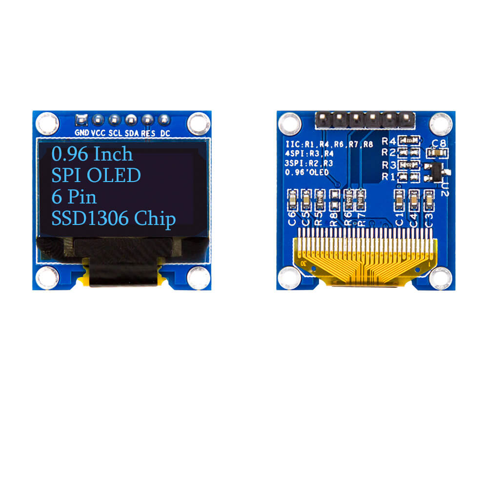
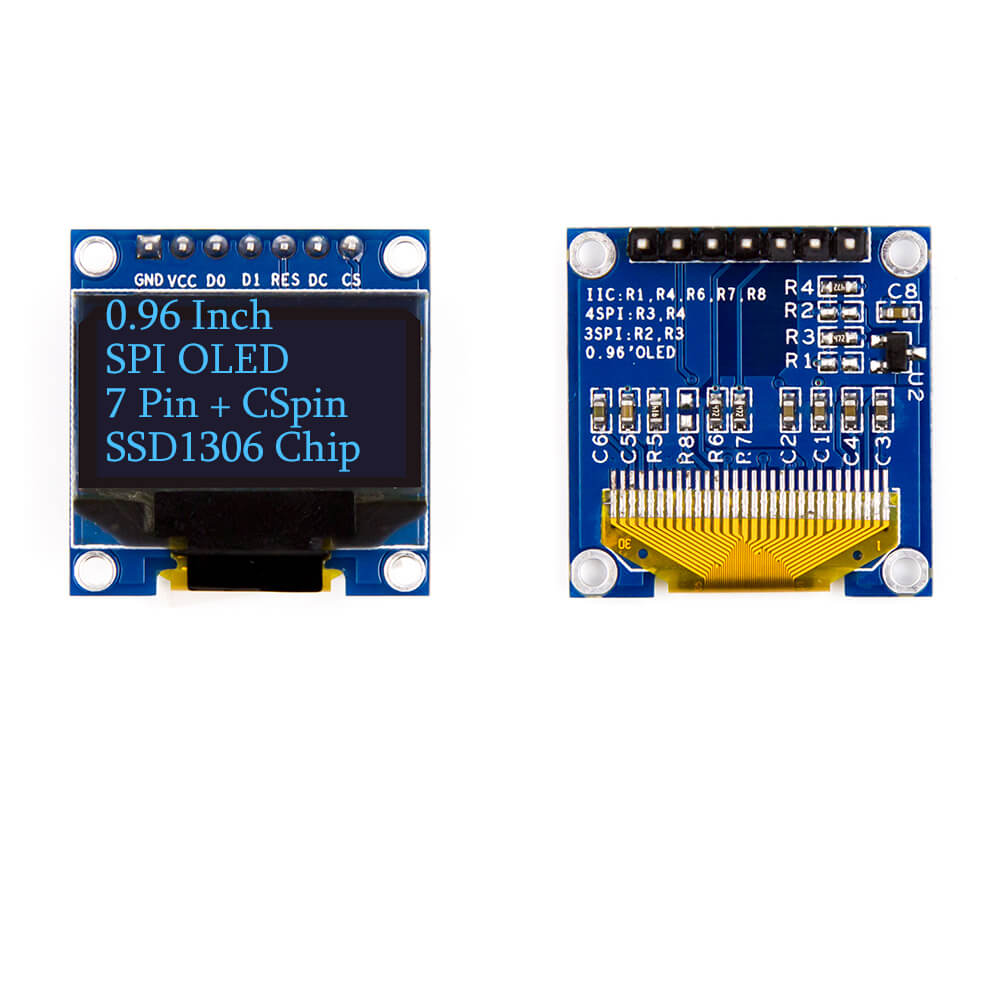

# OLED 0,96 inch 6 chân — Tài liệu tham khảo chân và giao tiếp với ESP32

Ngày biên soạn: **06/10/2026**. Phạm vi: module OLED có sáu nhãn **GND, VCC, SCL, SDA, RES, DC** do người dùng cung cấp; kết nối với **ESP32 DOIT DevKit V1 / ESP-WROOM-32** trong dự án này.

**Mã module, driver và cấu hình giao tiếp của màn hình thực tế: Chưa cung cấp.** Ảnh tham khảo bên dưới có đúng nhóm nhãn chân, được nhà cung cấp giới thiệu là SSD1306 chạy SPI. Vì vậy tài liệu đưa phương án **SSD1306, 128 × 64, SPI với D/C riêng** để tham khảo; cần đối chiếu PCB thực tế trước khi áp dụng. Không xác nhận driver hoặc điện áp chỉ từ kích thước 0,96 inch.

## Mục lục

1. [Cơ sở tài liệu và cách đọc ảnh](#1-cơ-sở-tài-liệu-và-cách-đọc-ảnh)
2. [Các linh kiện và khối chức năng](#2-các-linh-kiện-và-khối-chức-năng)
3. [Bảng đầy đủ sáu chân](#3-bảng-đầy-đủ-sáu-chân)
4. [Nguồn điện và mức logic](#4-nguồn-điện-và-mức-logic)
5. [Phân biệt SPI, I2C và chân CS bị lược bỏ](#5-phân-biệt-spi-i2c-và-chân-cs-bị-lược-bỏ)
6. [Gợi ý đấu nối với ESP32 DOIT DevKit V1](#6-gợi-ý-đấu-nối-với-esp32-doit-devkit-v1)
7. [Thư viện và ví dụ Arduino trên PlatformIO](#7-thư-viện-và-ví-dụ-arduino-trên-platformio)
8. [Gợi ý hiển thị cho dự án WiFi Scan](#8-gợi-ý-hiển-thị-cho-dự-án-wifi-scan)
9. [Tra lỗi khi đấu nối](#9-tra-lỗi-khi-đấu-nối)
10. [Nguồn tham khảo và nguồn ảnh](#10-nguồn-tham-khảo-và-nguồn-ảnh)

## 1. Cơ sở tài liệu và cách đọc ảnh



Ảnh lấy từ [Kuongshun — Blue SPI OLED LCD Module, tùy chọn 0.96 inch / 6 Pin](https://kuongshun.com/products/blue-spi-oled-lcd-module). Tệp cục bộ: [OLED-0.96-6PIN-SPI-kuongshun.jpg](../img/OLED-0.96-6PIN-SPI-kuongshun.jpg). Ảnh gồm **mặt trước ở trái, mặt sau ở phải**, không phải hai module cần mắc với nhau.

**Hướng nhìn:** nhìn mặt màn hình, hàng chân ở phía trên. Trong ảnh, từ trái sang phải là `GND → VCC → SCL → SDA → RES → DC`. Nhìn mặt sau sẽ đảo trái/phải; luôn đọc nhãn trên PCB đang cầm.

Chữ trên vùng màn hình là chú thích của ảnh sản phẩm, không phải kết quả chạy firmware. Ảnh là mẫu đối chiếu, **chưa xác nhận là đúng phiên bản PCB người dùng đang sở hữu**.

| Thông tin | Mức xác nhận cho màn hình thực tế |
| --- | --- |
| Kích thước danh nghĩa 0,96 inch | Theo mô tả người dùng; thường chỉ đường chéo vùng hiển thị, không phải kích thước toàn PCB |
| Sáu nhãn GND, VCC, SCL, SDA, RES, DC | Theo mô tả người dùng; chưa biết thứ tự vật lý trên PCB thực tế |
| SSD1306, 128 × 64 | Theo mẫu ảnh tham khảo; chưa xác nhận màn thực tế |
| Giao tiếp SPI | Phương án tham khảo phù hợp ý nghĩa SCK/MOSI và D/C người dùng nêu; vẫn cần xác nhận cấu hình PCB |
| Nguồn 3,3 V hoặc 5 V | Theo mô tả người dùng; cần thông số đúng module trước khi chọn 5 V |
| Màu hiển thị, kích thước PCB, dòng tiêu thụ, vị trí jumper | Chưa cung cấp |

Tên bán hàng có thể ghi “LCD OLED”, nhưng **OLED là công nghệ tự phát sáng**, khác LCD dùng tinh thể lỏng. Xem mô tả của [Adafruit về OLED monochrome](https://learn.adafruit.com/monochrome-oled-breakouts/overview).

## 2. Các linh kiện và khối chức năng

| Khối | Vai trò | Cách nhận biết hoặc giới hạn xác nhận |
| --- | --- | --- |
| Panel OLED | Hiển thị các điểm ảnh | Vùng đen ở mặt trước; chưa có thông số màu của màn thực tế |
| Driver/controller | Nhận lệnh, giữ dữ liệu ảnh, điều khiển panel | Mẫu tham khảo ghi SSD1306; không suy ra mã IC chỉ từ số chân |
| Cáp mềm FPC | Nối panel với PCB | Phần cáp vàng ở mép dưới ảnh |
| Header sáu chân | Nối nguồn và tín hiệu với ESP32 | Đọc nhãn PCB để xác định chân, không dùng hướng mặt sau để suy thứ tự mặt trước |
| Tụ và mạch nguồn | Lọc nguồn, hỗ trợ nguồn điều khiển panel | Model và trị số của màn thực tế chưa cung cấp |
| Điện trở/jumper chọn giao tiếp | Cấu hình kết nối các chân chọn bus của driver | Mặt sau mẫu ảnh có vị trí R1…R8; các module khác có thể bố trí khác |
| Lỗ bắt vít | Cố định PCB | Cần đo đường kính, khoảng cách nếu thiết kế vỏ |

Với SSD1306, dữ liệu ảnh được giữ trong RAM của controller; ESP32 chỉ cần gửi lại khi nội dung thay đổi. Tham khảo [datasheet SSD1306, mục 8.7](https://cdn-shop.adafruit.com/datasheets/SSD1306.pdf).

## 3. Bảng đầy đủ sáu chân

Số thứ tự dưới đây **chỉ theo ảnh mặt trước ở mục 1**. `IN` nghĩa là đầu vào của OLED, tức ESP32 xuất tín hiệu tới chân đó.

| Vị trí theo ảnh | Nhãn | Loại | Ý nghĩa khi dùng SPI với D/C riêng |
| --- | --- | --- | --- |
| 1 | GND | Nguồn | Mass 0 V; nối chung GND với ESP32 |
| 2 | VCC | Nguồn | Đầu cấp nguồn module; ưu tiên 3,3 V nếu đúng module cho phép |
| 3 | SCL / SCK / CLK / D0 | IN | Clock do ESP32 phát |
| 4 | SDA / MOSI / DIN / D1 | IN | Dữ liệu nối tiếp từ ESP32 tới OLED; không phải MISO |
| 5 | RES / RST / RESET | IN | Reset active LOW; bình thường ở HIGH |
| 6 | DC / D/C / A0 | IN | LOW để gửi lệnh; HIGH để gửi dữ liệu ảnh |

Ý nghĩa RES và D/C theo [datasheet SSD1306, mục 7 và 8.1.3](https://cdn-shop.adafruit.com/datasheets/SSD1306.pdf). Nhãn SCL/SDA trên module không tự quyết định bus đang dùng.

**Reset OLED khác reset ESP32:** RES của màn nối tới GPIO điều khiển riêng; EN của ESP32 reset toàn bộ vi điều khiển. Không mặc định nối hai chân này với nhau.

## 4. Nguồn điện và mức logic

Phương án thử ban đầu trong tài liệu là **VCC OLED nối 3V3 của ESP32**, theo thông tin module chấp nhận 3,3 V người dùng cung cấp. Nối GND chung, kiểm tra đúng nhãn nguồn trước khi bật.

| Đường điện | Cách dùng với ESP32 |
| --- | --- |
| VCC module OLED | Cấp 3,3 V khi module hỗ trợ mức này; chọn 5 V chỉ khi có thông số đúng PCB |
| SCK, MOSI, RES, DC | Logic 3,3 V từ GPIO ESP32 |
| GND | Nối GND OLED với GND ESP32; giữ dây nguồn và mass ngắn |
| Pull-up nếu chuyển sang I²C | Kiểm tra được kéo lên mức 3,3 V tương thích ESP32 |

**Nguồn module khác nguồn của IC trần.** Module có thể bổ sung ổn áp hoặc mạch chuyển mức; việc VCC module chấp nhận 5 V không có nghĩa mọi tín hiệu chấp nhận 5 V. Không áp thông số nguồn của một module hãng khác cho PCB đang dùng. [Adafruit — Wiring 128×64 OLEDs](https://learn.adafruit.com/monochrome-oled-breakouts/wiring-128x64-oleds)

ESP32 trong dự án dùng logic 3,3 V; tra giới hạn nguồn và GPIO tại [tài liệu ESP32 của dự án](ESP32_DOIT_DEVKIT_V1_REFERENCE.md#4-nguồn-điện-và-mức-logic).

Dòng tiêu thụ thực tế của màn này **chưa cung cấp**. Khi tích hợp WiFi, kiểm tra sụt áp lúc quét và lúc màn hiển thị nhiều điểm sáng; không lấy dòng của mẫu OLED khác làm kết luận cho module này.

## 5. Phân biệt SPI, I2C và chân CS bị lược bỏ

### 5.1. Vì sao SCL/SDA chưa đủ để kết luận I²C?

| Giao tiếp | Clock và data | Vai trò D/C | Cách chọn thiết bị |
| --- | --- | --- | --- |
| SPI với D/C riêng | SCK và MOSI | GPIO riêng phân biệt lệnh/dữ liệu | CS active LOW ở controller |
| I²C | SCL và SDA | Với SSD1306, D/C trở thành chân chọn bit địa chỉ SA0 | Địa chỉ trên bus |
| SPI 3-wire của SSD1306 | Clock, data và CS | Bit phân biệt lệnh/dữ liệu nằm trong chuỗi truyền 9 bit | CS ở controller |

Đây là cách hoạt động của **SSD1306**, không phải chứng nhận mọi OLED sáu chân đều dùng chip này. [Datasheet SSD1306, mục 8.1.3–8.1.5](https://cdn-shop.adafruit.com/datasheets/SSD1306.pdf)

Số dây trong tên “3-wire/4-wire SPI” là cách gọi giao tiếp của controller, **không phải tổng số chân header gồm nguồn và reset**. Bản sáu chân có D/C riêng không vì thiếu CS ở header mà tự trở thành SPI 3-wire.

### 5.2. Module sáu chân không có CS ở header

SSD1306 vẫn có CS nội bộ. Với module chạy SPI nhưng không đưa CS ra ngoài, một khả năng là **CS đã được nối LOW trên PCB** để màn luôn được chọn. Đây là suy luận về thiết kế thường gặp; cần sơ đồ hoặc kiểm tra đường mạch để xác nhận module thực tế.

Nếu CS thật sự luôn LOW:

- Có thể dùng màn với clock/data dành riêng cho nó.
- Không chia sẻ cùng SCK/MOSI với SD hoặc thiết bị SPI khác: OLED có thể nhận cả dữ liệu của thiết bị đó.
- `U8X8_PIN_NONE` trong ví dụ chỉ bảo thư viện bỏ thao tác GPIO CS; không thay thế hoặc sửa kết nối CS trên PCB.

### 5.3. Đối chiếu với bản bảy chân



Mẫu này có `GND, VCC, D0, D1, RES, DC, CS`. Ảnh từ [cùng nhà cung cấp Kuongshun](https://kuongshun.com/products/blue-spi-oled-lcd-module), tùy chọn **0.96 inch / 7 Pin**; dùng để thấy sự khác nhau ở chân CS, không dùng thay bảng sáu chân.

Một module sáu chân khác, [DFRobot DFR0650](https://wiki.dfrobot.com/dfr0650/), lại đưa **CS** ra header và không đưa **RES** ra. Vì vậy phải so sánh cả nhãn chân, không chỉ đếm số chân.

### 5.4. Nếu muốn chuyển sang I²C

Trước tiên xác nhận driver và cách chọn bus trên đúng PCB. Không chỉ thay `SPI` bằng `Wire` trong code. Điện trở/jumper, vai trò DC, reset, pull-up và địa chỉ đều cần cấu hình tương ứng.

Với SSD1306, địa chỉ I²C 7 bit có thể là `0x3C` hoặc `0x3D` theo SA0; **SPI không dùng các địa chỉ này**. Không dùng I²C scanner để kết luận một module đang ở SPI bị hỏng. [Datasheet SSD1306, mục 8.1.5](https://cdn-shop.adafruit.com/datasheets/SSD1306.pdf)

Mẫu ảnh mặt sau có chú thích chọn IIC/3SPI/4SPI; chỉ dùng để nhận biết có cấu hình phần cứng. Tài liệu này không hướng dẫn di chuyển điện trở khi chưa có sơ đồ đúng module.

## 6. Gợi ý đấu nối với ESP32 DOIT DevKit V1

Mapping dưới đây dành cho phương án **SSD1306 SPI với D/C riêng, CS nội bộ đã ở mức cho phép truyền**. Các số là GPIO ESP32, không phải số chân vật lý trên package chip.

| OLED | ESP32 | Vai trò |
| --- | --- | --- |
| GND | GND | Mass chung |
| VCC | 3V3 | Nguồn module 3,3 V |
| SCL / SCK | GPIO18 | Clock |
| SDA / MOSI | GPIO23 | Dữ liệu từ ESP32 tới màn |
| RES / RST | GPIO17 | Reset màn |
| DC / D/C | GPIO16 | Chọn lệnh hoặc dữ liệu |

GPIO18/23 thuận tiện nếu sau này chuyển sang SPI phần cứng; ví dụ ở mục 7 dùng **SPI phần mềm** để khai báo trực tiếp từng chân. Không nối MISO vì module mô tả không có chân đó. GPIO19, GPIO21/22 vẫn còn cho chức năng khác trong mapping này.

Đây là lựa chọn cho **WROOM-32 không PSRAM** trong tài liệu dự án. Nếu đổi board có PSRAM, kiểm tra lại GPIO16/17. Tham khảo [bảng chân ESP32](ESP32_DOIT_DEVKIT_V1_REFERENCE.md#32-hàng-phải).

Trình tự thử:

1. Tắt nguồn và đọc nhãn sáu chân trên module thực tế.
2. Đối chiếu driver, nguồn và cấu hình SPI; kiểm tra CS nội bộ nếu có sơ đồ/đường mạch phù hợp.
3. Nối theo bảng, dùng clock/data riêng; giữ các dây ngắn.
4. Build và thử ví dụ OLED độc lập trước khi ghép vào WiFi Scan.
5. Kiểm tra chữ, khung viền và bộ đếm; sau đó mới thêm nội dung mạng WiFi.

## 7. Thư viện và ví dụ Arduino trên PlatformIO

### 7.1. Thư viện

Ví dụ dùng [U8g2](https://github.com/olikraus/u8g2), có constructor khai báo clock/data/reset và hỗ trợ bỏ GPIO CS bằng `U8X8_PIN_NONE`. Xem [constructor reference](https://github.com/olikraus/u8g2/wiki/u8g2setupcpp) và [mã xử lý GPIO](https://github.com/olikraus/u8g2/blob/master/cppsrc/U8x8lib.cpp).

Trong một bản thử riêng, thêm vào môi trường `[env:esp32dev]` của PlatformIO:

```ini
lib_deps =
    olikraus/U8g2 @ 2.36.18
```

Đây là đoạn cấu hình tham khảo, không thay toàn bộ [platformio.ini](../platformio.ini). Tài liệu chưa tích hợp thư viện vào firmware WiFi Scan hiện tại.

### 7.2. Ví dụ OLED độc lập

**Điều kiện:** SSD1306 128 × 64, cấu hình SPI có D/C riêng, CS trên module đã cho phép truyền. Nếu module thực tế dùng driver hoặc bus khác, chọn đúng constructor trước khi thử.

```cpp
#include <Arduino.h>
#include <U8g2lib.h>

constexpr uint8_t OLED_SCK = 18;
constexpr uint8_t OLED_MOSI = 23;
constexpr uint8_t OLED_DC = 16;
constexpr uint8_t OLED_RST = 17;

// SPI phần mềm: thứ tự là rotation, clock, data, cs, dc, reset.
// Chỉ bỏ GPIO CS khi CS trên PCB OLED đã được nối phù hợp.
U8G2_SSD1306_128X64_NONAME_F_4W_SW_SPI oled(
    U8G2_R0, OLED_SCK, OLED_MOSI, U8X8_PIN_NONE, OLED_DC, OLED_RST);

void drawScreen(uint32_t seconds)
{
    oled.clearBuffer();
    oled.setFont(u8g2_font_6x10_tf);
    oled.drawFrame(0, 0, 128, 64);
    oled.drawStr(5, 14, "ESP32 OLED TEST");
    oled.drawStr(5, 29, "SSD1306 / SPI");
    oled.drawStr(5, 44, "128 x 64");
    oled.setCursor(5, 58);
    oled.print("Uptime: ");
    oled.print(seconds);
    oled.print("s");
    oled.sendBuffer();
}

void setup()
{
    Serial.begin(115200);
    oled.begin();  // Thư viện điều khiển reset và gửi chuỗi khởi tạo.
    drawScreen(0);
    Serial.println("OLED init sent; check the display visually.");
}

void loop()
{
    static uint32_t previousMs = 0;
    const uint32_t now = millis();

    if (now - previousMs >= 1000)
    {
        previousMs = now;
        drawScreen(now / 1000);
    }
}
```

Tên constructor: `SSD1306` là driver, `128X64` là kích thước ảnh, `F` là buffer toàn màn hình, `4W_SW_SPI` là giao tiếp SPI phần mềm với D/C riêng. Buffer ảnh 1 bit cần `128 × 64 / 8 = 1024 byte`, chưa tính cấu trúc thư viện. [U8g2 — Setup C++](https://github.com/olikraus/u8g2/wiki/u8g2setupcpp)

`clearBuffer()` xóa ảnh trong RAM; `sendBuffer()` mới chuyển nội dung tới màn. Tọa độ y trong `drawStr()` là baseline của chữ; ví dụ dùng ASCII để thử phần cứng trước khi chọn font hỗ trợ tiếng Việt. [U8g2 — Reference](https://github.com/olikraus/u8g2/wiki/u8g2reference)

Khởi tạo SPI gửi lệnh không có ACK giống I²C. Log “OLED init sent” không chứng minh màn đã nhận dữ liệu; cần quan sát hiển thị hoặc đo tín hiệu.

### 7.3. Build và giới hạn kiểm chứng

```bash
pio run -e esp32dev
```

Ví dụ trên đã **biên dịch thành công** trong project tạm ngày 06/10/2026 với `board = esp32dev`, Espressif32 **6.3.1**, Arduino-ESP32 **2.0.9**, U8g2 **2.36.18**. Đoạn C++ được trích trực tiếp từ tài liệu để build; firmware hiện tại không bị thay thế. **Chưa nạp hoặc kiểm thử trên màn hình thực tế.**

## 8. Gợi ý hiển thị cho dự án WiFi Scan

Đây là thiết kế đề xuất; firmware [src/main.cpp](../src/main.cpp) hiện xuất kết quả qua Serial.

| Vùng gợi ý | Nội dung |
| --- | --- |
| Dòng trạng thái | `Scanning...`, `Found: N`, `No networks`, `Scan failed` |
| Dòng SSID | Mạng đang chọn; cắt hoặc cuộn tên quá dài |
| Dòng chất lượng | RSSI dBm và channel |
| Dòng điều hướng | Chỉ số mạng, ví dụ `2/8`; có thể đổi trang bằng nút riêng |

Gợi ý triển khai:

- Hiện trạng thái quét trước khi gọi scan đồng bộ; cập nhật kết quả sau khi scan trả về.
- Phân biệt số mạng bằng 0 với giá trị lỗi âm; không hiển thị mọi trường hợp thành “không có mạng”.
- Sao chép dữ liệu cần hiển thị trước `WiFi.scanDelete()` nếu còn dùng sau khi giải phóng kết quả scan.
- Dùng Serial để giữ bảng chi tiết; màn 128 × 64 chỉ hiển thị phần cần đọc nhanh.
- Với SSID UTF-8, chọn font và API phù hợp; không cắt tùy ý giữa các byte của một ký tự.

API WiFi Scan tham khảo [mã WiFiScan của Espressif](https://github.com/espressif/arduino-esp32/blob/master/libraries/WiFi/src/WiFiScan.h). ESP32 cổ điển của dự án chỉ có WiFi 2,4 GHz; xem [tài liệu ESP32](ESP32_DOIT_DEVKIT_V1_REFERENCE.md#6-ngoại-vi-tích-hợp-trong-esp32).

## 9. Tra lỗi khi đấu nối

| Hiện tượng | Hướng kiểm tra |
| --- | --- |
| Màn đen dù có nguồn | Driver, bus trên PCB, dây SCK/MOSI/DC, trạng thái reset và CS nội bộ |
| Cấp nguồn nhưng chưa có firmware, màn không sáng | OLED cần chuỗi khởi tạo và dữ liệu; không có đèn nền để dùng làm chỉ báo nguồn |
| I²C scanner không tìm thấy module | Xác nhận module có thực sự ở I²C; bản SPI không phản hồi địa chỉ I²C |
| Chữ nhiễu hoặc hình lệch | Driver, độ phân giải, mapping chân, mode SPI và chất lượng dây; không kết luận SH1106 chỉ từ hiện tượng lệch |
| Màn hoạt động với ví dụ khác nhưng không hoạt động ở đây | Đối chiếu toàn bộ constructor, reset, CS và cấu hình bus của ví dụ đó |
| Chữ ngược hoặc quay 180° | Kiểm tra hướng lắp và rotation; U8g2 dùng U8G2_R2 để quay 180° |
| Hình bị thay đổi khi truy cập SD | OLED có thể luôn được chọn do CS nối LOW; tách clock/data khỏi thiết bị khác |
| Đổi dữ liệu nhưng màn giữ ảnh cũ | Đã gọi sendBuffer() sau khi vẽ chưa; có vô tình giữ màn ở reset không |
| Bật WiFi thì màn/ESP32 reset | Đo nguồn, kiểm tra cáp USB, mass và tiếp xúc dây |
| Log khởi tạo bình thường nhưng màn không hiển thị | SPI không có ACK xác nhận; đo RES/DC/SCK/MOSI hoặc xem màn trực tiếp |

Với logic analyzer, kiểm tra RES có nhả HIGH, SCK có xung khi gửi ảnh, MOSI có dữ liệu và DC thay đổi giữa lệnh/dữ liệu. Khi đã xác nhận SSD1306 4-wire SPI, bắt đầu giải mã **mode 0, MSB trước**; cấu hình này cũng được driver U8g2 sử dụng. [Driver SSD1306 của U8g2](https://github.com/olikraus/u8g2/blob/master/csrc/u8x8_d_ssd1306_128x64_noname.c)

## 10. Nguồn tham khảo và nguồn ảnh

Các nguồn dưới đây được đối chiếu khi biên soạn. Thông số của module hãng khác chỉ dùng để phân biệt phiên bản, không xác nhận phần cứng đang sở hữu.

| Nguồn | Nội dung sử dụng |
| --- | --- |
| [Kuongshun — Blue SPI OLED LCD Module](https://kuongshun.com/products/blue-spi-oled-lcd-module) | Ảnh đối chiếu sáu chân và bảy chân, mẫu ghi SSD1306; trang có nhiều tùy chọn kích thước/driver |
| [SSD1306 Datasheet — Solomon Systech, lưu tại Adafruit](https://cdn-shop.adafruit.com/datasheets/SSD1306.pdf) | Ý nghĩa RES/DC/CS, giao tiếp và RAM ảnh |
| [Adafruit — OLED Overview](https://learn.adafruit.com/monochrome-oled-breakouts/overview) | Công nghệ OLED tự phát sáng |
| [Adafruit — Wiring 128×64 OLEDs](https://learn.adafruit.com/monochrome-oled-breakouts/wiring-128x64-oleds) | Phân biệt nguồn module và logic, cách đấu SPI/I²C theo board |
| [DFRobot DFR0650](https://wiki.dfrobot.com/dfr0650/) | Ví dụ OLED sáu chân có CS thay vì RES |
| [U8g2 — Setup C++](https://github.com/olikraus/u8g2/wiki/u8g2setupcpp) | Constructor, loại buffer và bus |
| [U8g2 — Reference](https://github.com/olikraus/u8g2/wiki/u8g2reference) | Buffer, font, vẽ và gửi ảnh |
| [U8g2 — U8x8lib.cpp](https://github.com/olikraus/u8g2/blob/master/cppsrc/U8x8lib.cpp) | Bỏ thao tác GPIO khi chân là U8X8_PIN_NONE |
| [U8g2 — SSD1306 driver](https://github.com/olikraus/u8g2/blob/master/csrc/u8x8_d_ssd1306_128x64_noname.c) | Cấu hình SPI và reset |
| [Espressif — WiFiScan.h](https://github.com/espressif/arduino-esp32/blob/master/libraries/WiFi/src/WiFiScan.h) | API scan và giải phóng kết quả |
| [Tài liệu ESP32 trong dự án](ESP32_DOIT_DEVKIT_V1_REFERENCE.md), [platformio.ini](../platformio.ini) | Chọn GPIO và môi trường phát triển |

### Nguồn ảnh cục bộ

| Tệp | URL ảnh gốc | Cách dùng |
| --- | --- | --- |
| [OLED-0.96-6PIN-SPI-kuongshun.jpg](../img/OLED-0.96-6PIN-SPI-kuongshun.jpg) | [AA140.jpg](https://cdn.shopify.com/s/files/1/0069/6513/3376/products/AA140.jpg?v=1557287697) | Mẫu 0,96 inch / 6 Pin, mặt trước và sau |
| [OLED-0.96-7PIN-SPI-kuongshun-comparison.jpg](../img/OLED-0.96-7PIN-SPI-kuongshun-comparison.jpg) | [AA141.jpg](https://cdn.shopify.com/s/files/1/0069/6513/3376/products/AA141.jpg?v=1557287699) | Mẫu 0,96 inch / 7 Pin, chỉ dùng đối chiếu chân CS |

Ảnh tải ngày **06/10/2026**, giữ nguyên nội dung và chú thích của nguồn. Quyền đối với ảnh thuộc chủ sở hữu; chưa xác định giấy phép tái sử dụng công khai trên trang nguồn.
